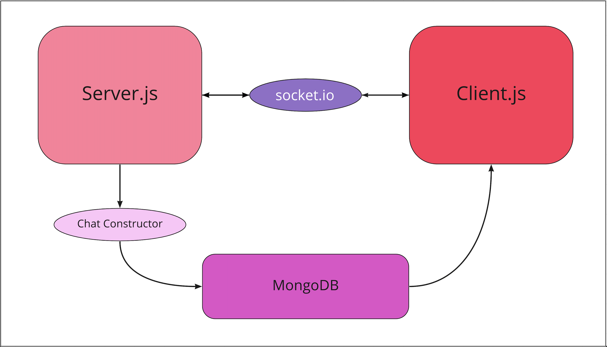

# People Helping People

### [Jason Taisey](https://github.com/JTaisey389), [Jessi Velazquez](https://github.com/JessiVelazquez), [Nicki Baldwin](https://github.com/nickibaldwin), [Simone Odegard](https://github.com/SimoneOdegard)

## Private Chat Application using MongoDB and Socket.io

This repository contains a fully functional private chat application using MongoDB and Socket.io that supports real-time chatting globally or privately. This functionality is designed to connect people who need assistance to connect with others who can provide that.

## Tech-stack -

- JavaScript
- http (server)
- Node.js
- Socket.io (real-time interaction between the client and the server)
- MongoDB (database to store chats)
- Netlify (deployment)

## Features of this app -

- The app contains real-time chat between two private users or a group
- The chat history can be retirieved later when the chat is accessed by the user
- The chat between two people will not be broadcasted to other users online
- If an active user sends a message to another user while they are offline, the other user will be able to retirieve message later when he accesses the chat

## Usage Guide -

1. Install [Node.js](https://nodejs.org/) and [MongoDB](https://www.mongodb.com/) on your system. Check using the following commands in the terminal -

```
node -v

mongod --version
```

2. Open your terminal and run the following -

  ```
  git clone https://github.com/PeopleHalpingPeople/people-helping-people-backend

  cd people-helping-people-backend

  npm i

  node server.js

  node client.js <UserNameHere>
  ```

3. Recieve messages that were stored in chat database

4. Start chatting

- Private Message: /to < RecieverUserName > < message >
- Global Message: < message >

5. To Disconnect ```ctrl-c```

## UML - 

